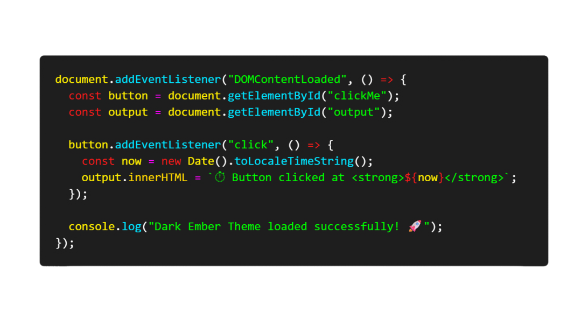
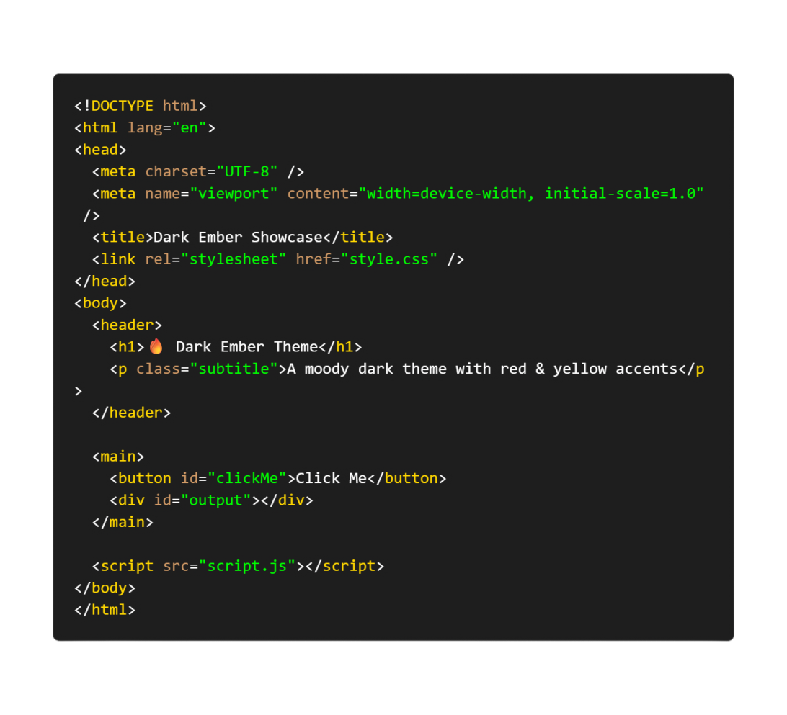

# 🌑 Dark Ember – VS Code Theme

Bring the **underground vibe** to your VS Code 🔥  
**Dark Ember** makes your code pop with **red & yellow highlights** on a sleek dark background. Perfect for devs who code hard and like it stylish.

---

## ✨ Preview

---

## 🚀 Installation

1. Open **Visual Studio Code**
2. Go to the **Extensions** tab (`Ctrl + Shift + X`)
3. Search for **Dark Ember** or install directly via the [Marketplace](https://marketplace.visualstudio.com/items?itemName=SaunKiziN.dark-ember)
4. Activate: **File > Preferences > Color Theme > Dark Ember**

💡 **Pro Tip:** Works best with **monospaced fonts** and minimal icons to let the colors pop.

---

## 🛠 Showcase Project

Test with the mini showcase project:

- **HTML**
- **CSS**
- **JavaScript**
- **Markdown**

👉 Open the `showcase/` folder in VS Code and jump between the files to see Dark Ember shine.

---

## 📝 Contribution

Have ideas or improvements? Open an **Issue** or **Pull Request** on the [GitHub Repository](https://github.com/SaunKiziN/Dark-Ember-Theme).  
Your feedback keeps Dark Ember alive 💀🔥

---

## 📌 Info

- **Author:** [SaunKiziN](https://github.com/SaunKiziN)
- **Version:** 0.0.1
